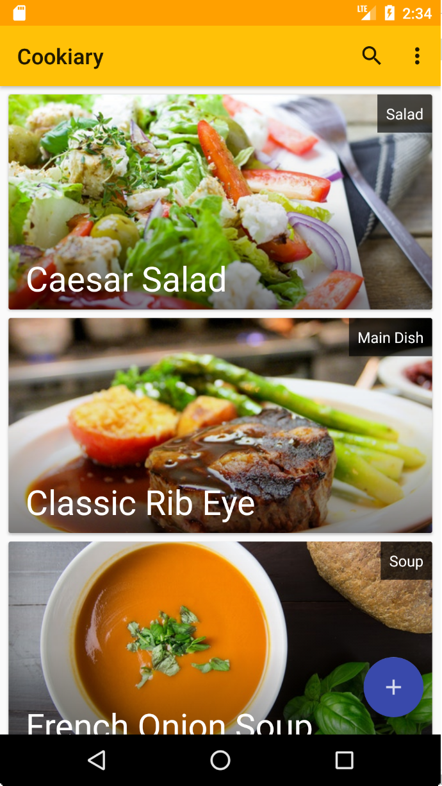
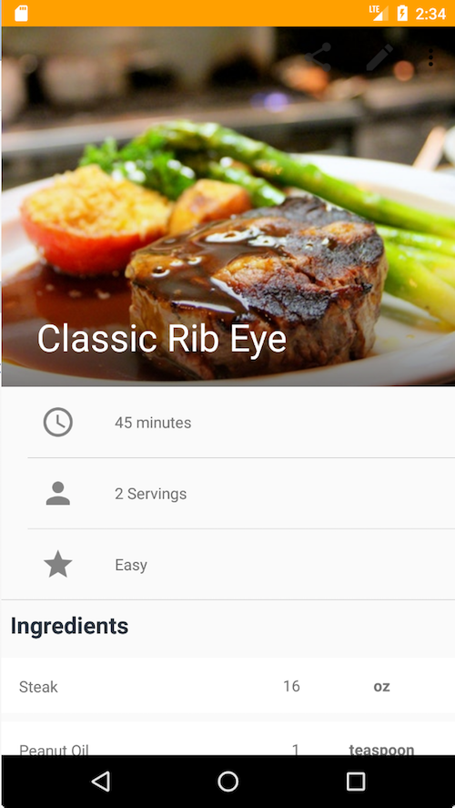
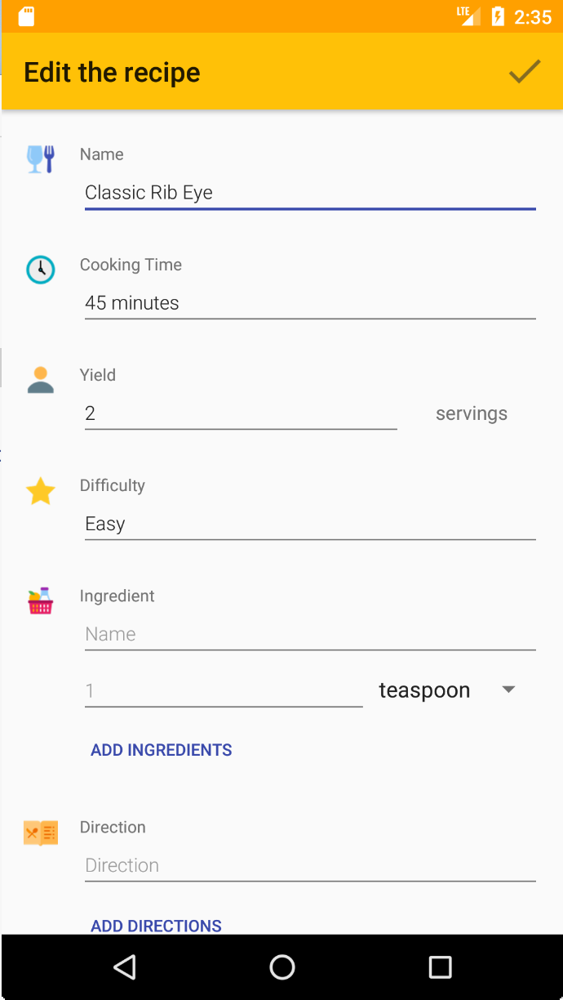

Cookiary
==============================================================================
Cookiary is a personal cookbook for users who love cooking. For more detail: 

## Main Features
 1. Display recipes and details with user-friendly UI.
 2. Create and record your own recipe.
 3. Categorize the recipes
 4. Update recipes information.
 5. Search for the recipes by name or category.
 6. Delete recipes
 7. Share the recipes
 8. Support English and Chinese(Simplified & Traditional)
  
  
  
## Screenshots

  
  

  
  

## Future
1. Server side implementation: 
* The user can view the recipe via web browsers.
* News feed
2. UI improvement

## License
    Copyright 2018, Chun-Chieh Liang
    ＜/br＞
    Licensed under the Apache License, Version 2.0 (the "License");
    you may not use this file except in compliance with the License.
    You may obtain a copy of the License at 
    ＜/br＞
      http://www.apache.org/licenses/LICENSE-2.0

    ＜/br＞
    Unless required by applicable law or agreed to in writing, software
    distributed under the License is distributed on an "AS IS" BASIS,
    WITHOUT WARRANTIES OR CONDITIONS OF ANY KIND, either express or implied.
    See the License for the specific language governing permissions and 
    limitations under the License.
    
    